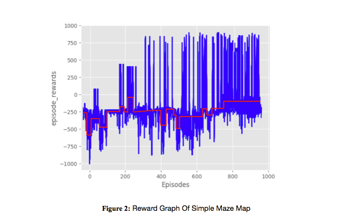

# Maze Solving Robot

The aim of the project was to create an intelligent robot that can be used in dangerous environments where humans cannot reach or where there are elements that threaten human life. Although the maze solver robot is not in its current form; It can be adapted for ambulances, firefighters or rescuers to accurately find the shortest path to their destination.

## Reinforcement Learning

Reinforcement Learning is a method of machine learning where the agent learns over time through trial and error iteratively with the environment. The purpose of the algorithm is for an agent to learn to perform certain actions in the environment that lead to maximum reward. In Reinforcement Learning, the agent selects an action while in a certain state. Then the agent receives rewards of plus or minus value depending on the chosen action. And with the information sent back from the environment, the agent switches to its new state. Reinforcement learning has many uses and is becoming more popular by the day. One of the reasons for this is that it was learned that the RL algorithm was used in autonomous cars and rockets produced by Elon Musk's SpaceX company. Moreover, its popularity increased even more when the best go player in the world was defeated by the RL agent.

## Q-Learning

Q-Learning is a popular Reinforcement Learning algorithm based on reward system. On the way to the reward, the agent uses the experience gained in each iteration to choose where to go. It keeps these experiences in a table called the Q-Table. The Q-Table is a table that helps us find the best action for each situation.

Since the Q-Table is initially empty, the agent moves randomly in the first stage. These random movements then continue until the agent finds the first reward. The agent updates the Q-Table as soon as it finds the reward. In each update, the agent anticipates the next step according to this algorithm and tries to reach the maximum reward. After reaching the reward, the agent starts acting randomly again and tries to find the reward again. As these processes continue, the agent learns the environment and understands where to go in which situation.

## Terms Needed To Understand The Algorithm

### Agent

Agent is an entity trying to learn the best way to perform a certain task in an unknown environment to earn a Reward. In this project, the “Turtlebot3 Burger” was used as the agent, as it contains many sensors.

### Action

All possible actions that the agent can take. In this project, 3 actions are defined so that the agent can explore the environment. These are going forward, going right, and going left.

### State

Describes the current status of the agent. The agent can switch to different states after performing an action. It is a type of feedback given to the agent based on the agent's action.

### Reward

Information is given by the environment to evaluate the last action of the agent. If the agent's action is good, the agent is given a positive reward, otherwise a negative reward. In this way, the agent is encouraged to learn and choose actions by receiving positive rewards. In this project, negative values are rewarded after each action to encourage the agent to act quickly. The same process is repeated in order not to crash into the walls of the labyrinth and not to cross the paths it has discovered again. When the agent reaches the exit, they receive an additional reward and are encouraged to exit.

### Environment

The environment represents the physical world in which an agent operates. Two environments, simple and complex, were used in this project. Next, the agent's ability to explore these two different environments and find the shortest path is tested.

### Exploration And Exploitation

Exploration, while finding more information about the environment; Exploitation uses the known information to maximize the reward. In the case of exploration and exploitation, the agent can use the known states to get high rewards or to explore more of the maze. A balance must be struck between these two strategies in order to find effective ways with optimal values and get the most rewards in the shortest amount of time. This balance is achieved using Epsilon-Greedy.

### Epsilon-Greedy

When the agent starts learning, he must choose random actions to explore more paths in the maze. In this project, the epsilon value is high at first because the Q-Table is empty and the agent knows nothing. However, as the agent explores, the Q function becomes more consistent, and as the agent learns more and more, this epsilon value decreases after each episode, and the robot gradually moves from exploration to exploitation.

## Testing

The robot was tested in two different environments to see if the robot and the algorithm were working correctly.

The first of these is a simple maze as seen in Figure 1. There are no extra obstacles in the maze and the red dot represents the exit from the maze. The robot must find the exit by the shortest route and using as little time as possible. For this reason, first of all, it was observed how long it took the robot to reach the exit by using a simple labyrinth. In addition, it was examined whether the robot went directly to the exit or to the long distance.

The reward graph as well as the observed robot movements are visualized as in Figure 2. As can be seen from the graph, the reward value is low in the first stages, as the robot does not know the environment and exploration rate in the first place. This is because the rate of choosing random actions in the first episodes is high. The graph also shows that the average episode reward varies a lot in the top 500 episodes. And after that, the reward is more stable in the simple maze. This shows that the robot has completed its learning and can reach the exit in the shortest time by following the same path continuously.

The second environment in which the robot is tested is a more complex labyrinth. As shown in Figure 3, this maze contains obstacles and dead ends. Because the maze is more complex, the robot will need more iterations than the other maze to get to the exit and get to know the environment. Because the maze has a more complex structure and there are more places to explore in the maze.

When the reward graph of the maze in Figure 4, which has a complex structure, is examined, the amount of reward increased in the next sections compared to the graph in Figure 2. In addition, the graph did not follow a straight path and raise more slowly. This is because the maze has a more complex structure, so more partitions are required to make the Q table reliable and stable. In short, due to the complexity of the maze, the number of iterations must be high for the robot to learn.

## Tools Needed

- Reinforcement Learning
- Q-Learning
- ROS
- Gazebo
- Python
